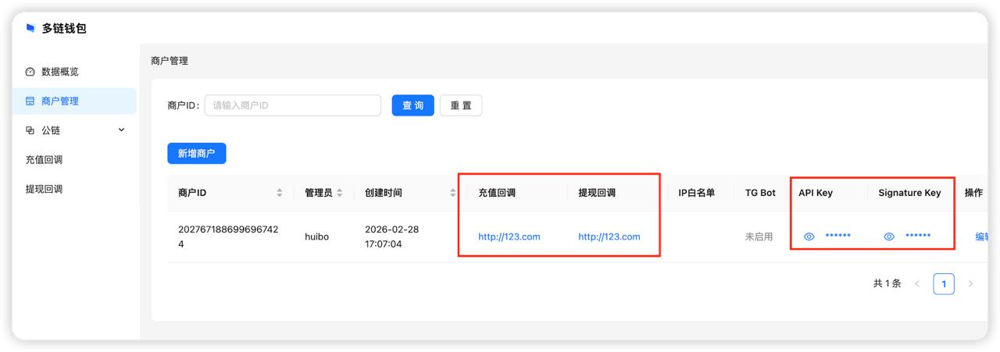

# 数字钱包平台 - 第三方接入文档（V2 API）

本文档面向接入方，描述如何通过 **V2 API** 与数字钱包平台集成，包括鉴权方式、接口列表、请求与响应格式

- [数字钱包平台 - 第三方接入文档（V2 API）](#数字钱包平台---第三方接入文档v2-api)
  - [接入流程建议](#接入流程建议)
  - [鉴权说明](#鉴权说明)
    - [API Key](#api-key)
    - [通用响应结构](#通用响应结构)
  - [V2 接口概览](#v2-接口概览)
  - [充值（Deposit）](#充值deposit)
    - [创建充值 / 获取地址](#创建充值--获取地址)
    - [充值订单列表](#充值订单列表)
    - [查询充值订单](#查询充值订单)
    - [取消充值订单](#取消充值订单)
  - [地址列表](#地址列表)
  - [提现（Withdraw）](#提现withdraw)
    - [创建提现](#创建提现)
    - [提现记录列表](#提现记录列表)
    - [查询提现](#查询提现)
    - [取消提现](#取消提现)
    - [查询余额](#查询余额)
  - [平台主动回调（Webhook）](#平台主动回调webhook)
    - [回调签名与认证](#回调签名与认证)
    - [验证收到的签名](#验证收到的签名)
  - [Telegram 通知接入](#telegram-通知接入)
  - [错误码说明](#错误码说明)
  - [测试代币领取说明](#测试代币领取说明)

---

## 接入流程建议

* 平台会提供后台账号，登录后台创建商户，配置**充值回调 URL**、**提现回调 URL**，添加后会生成 **API Key** 和 **Signature Key**。
   
* 拿到 **API Key** 后，将其放到请求Header中即可调用 API。建议流程：
  * **充值**：调用 [创建充值](#创建充值--获取地址) 获取收款地址（可带订单信息），用户向该地址充值，链上确认后平台会调用充值回调。
  * **提现**：调用 [创建提现](#创建提现) 提交提现，链上确认后平台会调用提现回调。
* 平台通知（如提现余额不足、回调异常等）可通过 [Telegram 通知](#telegram-通知接入) 接收，建议配置。

---

## 鉴权说明

### API Key

所有接口均需在请求头中携带商户 API Key：

| Header 名称 | 说明 |
|------------|------|
| `apikey`   | 在后台「商户管理」中获取，用于标识商户身份 |

示例：`apikey: your_merchant_api_key_here`

### 通用响应结构

接口统一返回 JSON，所有响应均包含 `code` 与 `msg`；成功时另有 `data` 承载业务数据。

**成功：** `{ "code": 0, "msg": "success", "data": { ... } }`  
**失败：** `{ "code": 10001, "msg": "错误描述" }`

- `code`：0 表示成功，非 0 见 [错误码说明](#错误码说明)。
- `msg`：成功时为 `"success"`，失败时为具体描述。
- `data`：成功时按接口约定返回；失败时通常无或为空。

---

## V2 接口概览

基础路径：**`/v2`**

| 分类     | 方法 | 路径 | 说明 |
|----------|------|------|------|
| 充值     | POST | `/v2/deposit/create` | 创建充值/获取地址（可选订单） |
| 充值     | GET  | `/v2/deposit/list`  | 充值订单列表（分页） |
| 充值     | GET  | `/v2/deposit/get`   | 按 orderID 查询充值订单 |
| 充值     | POST | `/v2/deposit/cancel`| 取消充值订单 |
| 地址     | GET  | `/v2/address/list`  | 地址列表（按链分页） |
| 提现     | POST | `/v2/withdraw/create` | 创建提现 |
| 提现     | GET  | `/v2/withdraw/list`   | 提现记录列表（按链分页） |
| 提现     | GET  | `/v2/withdraw/get`    | 按 orderID 查询提现 |
| 提现     | POST | `/v2/withdraw/cancel`| 取消提现 |
| 提现     | GET  | `/v2/withdraw/balance`| 查询提现地址余额 |

V2 以 **chain**（`eth` / `tron`）和 **orderID**（商户订单号）统一多链与订单维度，无需按链拆分路径。

---

## 充值（Deposit）

### 创建充值 / 获取地址

**POST** `/v2/deposit/create`

获取或创建一条与 `accountID` 绑定的充值地址；可选传入 `order` 创建充值订单（金额、orderID、过期时间等），便于后续按订单查询与回调关联。

**请求体（JSON）：**

| 参数       | 类型   | 必填 | 说明 |
|------------|--------|------|------|
| chain      | string | 是   | 链：`eth` 或 `tron` |
| accountID  | string | 是   | 账户ID。相同的accountID生成的地址会是一样的 |
| order      | object | 否   | 订单信息；不传则仅返回地址，不创建订单 |

**order 对象（可选）：**

| 参数          | 类型   | 必填 | 说明 |
|---------------|--------|------|------|
| orderID       | string | 是*  | 商户订单号（传 order 时必填），商户内唯一 |
| amount        | string | 是*  | 期望充值金额（传 order 时必填，支持小数） |
| contractAddr  | string | 否   | 代币合约地址 |
| expireAt      | int64  | 否   | 订单过期时间戳（秒）；不传则默认 7 天内 |

**响应 data：**

| 字段      | 类型   | 说明 |
|-----------|--------|------|
| addr      | string | 充值地址（与 accountID 绑定，幂等） |
| orderID   | string | 传入 order 时返回 |
| expireAt  | int64  | 传入 order 时返回订单过期时间戳 |

**说明：** 同一 `chain` + `accountID` 参数相同，返回的充值地址也会相同。accountID最好填用户的ID这样和用户关联的值，这样同一用户，生成的地址永远相同，充值不容易出错。

---

### 充值订单列表

**GET** `/v2/deposit/list`

分页查询本商户的充值订单列表。

**Query 参数：**

| 参数      | 类型   | 必填 | 说明 |
|-----------|--------|------|------|
| page      | int    | 是   | 页码，从 1 开始 |
| pageSize  | int    | 是   | 每页条数，1～100 |
| accountID | string | 否   | 按 accountID 筛选 |

**响应 data：**

| 字段  | 类型   | 说明 |
|-------|--------|------|
| total | int64  | 总条数 |
| items | array  | 充值订单列表 |

**items 元素（MerchantDepositOrder）：** 含 `id`、`merchantID`、`orderID`、`chain`、`accountID`、`accountAddr`、`contractAddr`、`amount`、`expireAt`、`status`、`createdAt`、`updatedAt` 等。`status`：1=待支付，2=已完成，3=已取消，4=已超时。

---

### 查询充值订单

**GET** `/v2/deposit/get`

按商户订单号查询一条充值订单。

**Query 参数：**

| 参数    | 类型   | 必填 | 说明 |
|---------|--------|------|------|
| orderID | string | 是   | 创建充值时传入的 orderID |

**响应 data：** 单条充值订单对象（结构同列表项）。未找到返回「order not found」。

---

### 取消充值订单

**POST** `/v2/deposit/cancel`

取消一条待支付的充值订单。

**请求体（JSON）：**

| 参数    | 类型   | 必填 | 说明 |
|---------|--------|------|------|
| orderID | string | 是   | 商户订单号 |

**响应 data：** 空对象 `{}`。已取消会直接成功；已完成的订单不可取消，返回「order already done, cannot cancel」。

---

## 地址列表

**GET** `/v2/address/list`

分页查询本商户在指定链上的充值地址列表。

**Query 参数：**

| 参数     | 类型   | 必填 | 说明 |
|----------|--------|------|------|
| chain    | string | 是   | 链：`eth` 或 `tron` |
| page     | int    | 是   | 页码，从 1 开始 |
| pageSize | int    | 是   | 每页条数，1～100 |

**响应 data：**

| 字段  | 类型   | 说明 |
|-------|--------|------|
| total | int64  | 总条数 |
| items | array  | 地址列表 |

**items 元素：** `addr`（地址）、`accountID`（账户 ID）、`createdAt`（创建时间）。

---

## 提现（Withdraw）

### 创建提现

**POST** `/v2/withdraw/create`

提交一笔提现申请，平台将异步处理并回调结果。以 **orderID** 作为商户侧唯一标识，同一商户下 orderID 不可重复。

**请求体（JSON）：**

| 参数          | 类型   | 必填 | 说明 |
|---------------|--------|------|------|
| chain         | string | 是   | 链：`eth` 或 `tron` |
| toAddr        | string | 是   | 收款地址（ETH 为 0x 格式，TRON 为 T 开头） |
| contractAddr  | string | 是   | 代币合约地址 |
| amount        | string | 是   | 提现数量（支持小数） |
| orderID       | string | 是   | 商户提现订单号，商户内唯一 |

**响应 data：**

| 字段    | 类型   | 说明 |
|---------|--------|------|
| orderID | string | 与请求一致 |


---

### 提现记录列表

**GET** `/v2/withdraw/list`

分页查询本商户在指定链上的提现记录。

**Query 参数：**

| 参数     | 类型   | 必填 | 说明 |
|----------|--------|------|------|
| chain    | string | 是   | 链：`eth` 或 `tron` |
| page     | int    | 是   | 页码，从 1 开始 |
| pageSize | int    | 是   | 每页条数，1～100 |

**响应 data：**

| 字段  | 类型   | 说明 |
|-------|--------|------|
| total | int64  | 总条数 |
| items | array  | 提现记录列表（ETH 为 Erc20Withdraw，TRON 为 Trc20Withdraw） |

**items 元素：** 含 `id`、`orderID`、`from`、`to`、`txid`、`tokenAddress`、`tokenSymbol`、`amount`、`memo`（V2 中与 orderID 一致）、`status`、`confirmNum`、`currentConfirmNum`、`createdAt`、`updatedAt` 等。`status`：1=已入库等待广播，2=已广播等待确认，3=已完成，4=链上失败，5=已取消，6=未知。

---

### 查询提现

**GET** `/v2/withdraw/get`

按 orderID 查询一条提现记录。

**Query 参数：**

| 参数    | 类型   | 必填 | 说明 |
|---------|--------|------|------|
| chain   | string | 是   | 链：`eth` 或 `tron` |
| orderID | string | 是   | 创建提现时传入的 orderID |

**响应 data：** `item` 为单条提现记录对象。未找到返回「withdraw not found」。

---

### 取消提现

**POST** `/v2/withdraw/cancel`

取消一笔尚未广播的提现。按 orderID 查找，自动区分 ETH/TRON。

**请求体（JSON）：**

| 参数    | 类型   | 必填 | 说明 |
|---------|--------|------|------|
| orderID | string | 是   | 商户提现订单号 |

**响应 data：** 空对象 `{}`。已广播不可取消，返回「withdraw already broadcast, cannot cancel」；未找到返回「withdraw not found」。

---

### 查询余额

**GET** `/v2/withdraw/balance`

查询当前商户在指定链、指定代币下的**提现地址**余额（代币余额与 gas 费余额）。用于提现前确认可用额度。默认返回缓存数据；传 `syncFromChain=true` 时从链上拉取最新余额。

**Query 参数：**

| 参数           | 类型   | 必填 | 说明 |
|----------------|--------|------|------|
| chain          | string | 是   | 链：`eth` 或 `tron` |
| contractAddr   | string | 是   | 代币合约：ETH 链传空或 `eth` 表示原生 ETH；TRON 链传空或 `trx` 表示 TRX，否则为 TRC20/ERC20 合约地址 |
| syncFromChain  | bool   | 否   | 为 `true` 时从链上同步最新余额，再返回；不传或为 `false` 时仅返回缓存值 |

**响应 data：**

| 字段          | 类型   | 说明 |
|---------------|--------|------|
| tokenBalance  | string | 该合约代币余额（可用于提现的额度） |
| gasBalance    | string | 链上 gas 费余额：ETH 链为 ETH 余额，TRON 链为 TRX 余额 |
| tokenSymbol   | string | 代币符号（如 ETH、TRX、USDT），便于前端展示 |

---

## 平台主动回调（Webhook）

平台会向商户在后台配置的 URL 主动推送**充值**与**提现**结果，接入方需实现可公网访问的 HTTP 接口并验证签名。

### 回调签名与认证

- 使用后台配置的**签名密钥（Signature Key）**与**请求 body 原文**做 **HMAC SHA256**，得到十六进制字符串，与请求头 **X-Signature** 比对。
- 充值回调：达到确认数后 POST 到**充值回调 URL**，body 含 `address`、`txid`、`time`、`confirmations`、`chain`、`height`、`tokenAddress`、`tokenSymbol`、`tokenDecimal`、`tokenValue` 等；若有关联订单会带 `orderID`。
- 提现回调：达到确认数后 POST 到**提现回调 URL**，格式与充值类似，并多出 `memo` 字段（V2 中为提现的 orderID）。
- 响应要求：HTTP 200 且 body 返回字符串 `ok`，否则平台会重试（最多 3 次）。

### 验证收到的签名

示例（Python）：

```python
import hmac, hashlib
data = bytes(request_body_string, 'utf-8')
key = bytes(signing_key, 'utf-8')
digest = hmac.new(key, data, digestmod=hashlib.sha256).hexdigest()
# digest 应与 Header X-Signature 一致
```

---

## Telegram 通知接入

| code | 说明 |
|------|------|
| 0 | 成功 |
| 10000 | 服务器内部错误 |
| 10001 | 参数错误（必填项、格式、业务校验等） |
| 10002 | 没有权限 |
| 10003 | 重复的 key（如 orderID 已存在） |
| 10004 | 记录不存在 |
| 10005 | 第三方服务错误 |
| 14001 | API Key 错误（缺失、无效或与商户不匹配） |
| 14002 | IP 不在白名单 |
| 14003 | 商户数量或资源达到上限 |
| 20101 | 提现配置错误（未配置、已禁用等） |
| 20102 | 提现地址 gas 费不足（TRX/ETH） |
| 20103 | 提现地址代币余额不足 |

---

## 错误码说明

接口失败时，`code` 为非 0，`msg` 为具体描述。以下为 API 可能返回的错误码（V1/V2 通用）。

| code | 说明 |
|------|------|
| 0 | 成功 |
| 10000 | 服务器内部错误 |
| 10001 | 参数错误（必填项、格式、业务校验等） |
| 10002 | 没有权限 |
| 10003 | 重复的 key（如 orderID 已存在） |
| 10004 | 记录不存在 |
| 10005 | 第三方服务错误 |
| 14001 | API Key 错误（缺失、无效或与商户不匹配） |
| 14002 | IP 不在白名单 |
| 14003 | 商户数量或资源达到上限 |
| 20101 | 提现配置错误（未配置、已禁用等） |
| 20102 | 提现地址 gas 费不足（TRX/ETH） |
| 20103 | 提现地址代币余额不足 |

详细文案以响应中的 `msg` 为准。

## 测试代币领取说明

平台目前支持 **ETH** 和 **TRON** 公链的 USDT 等代币充值/提现，测试环境可通过以下方式获取测试代币：

| 链 / 环境 | 代币 | 合约地址 / 说明 | 领取方式 |
|-----------|------|-----------------|----------|
| **TRON（尼罗河测试网）** | USDT | `TXYZopYRdj2D9XRtbG411XZZ3kM5VkAeBf` | 在 [Nile 测试网水龙头](https://nileex.io/join/getJoinPage) 领取测试 USDT |
| **ETH（测试网）** | USDT | `0xb65F0057AEE4e3D511607a050379B7558a15c67D` | 该合约为平台提供的测试 USDT，需向平台申请领取 |

---
