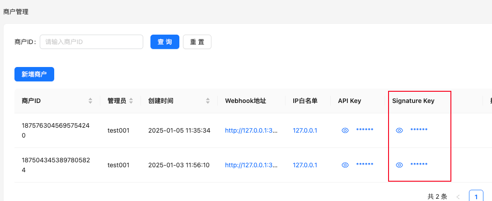
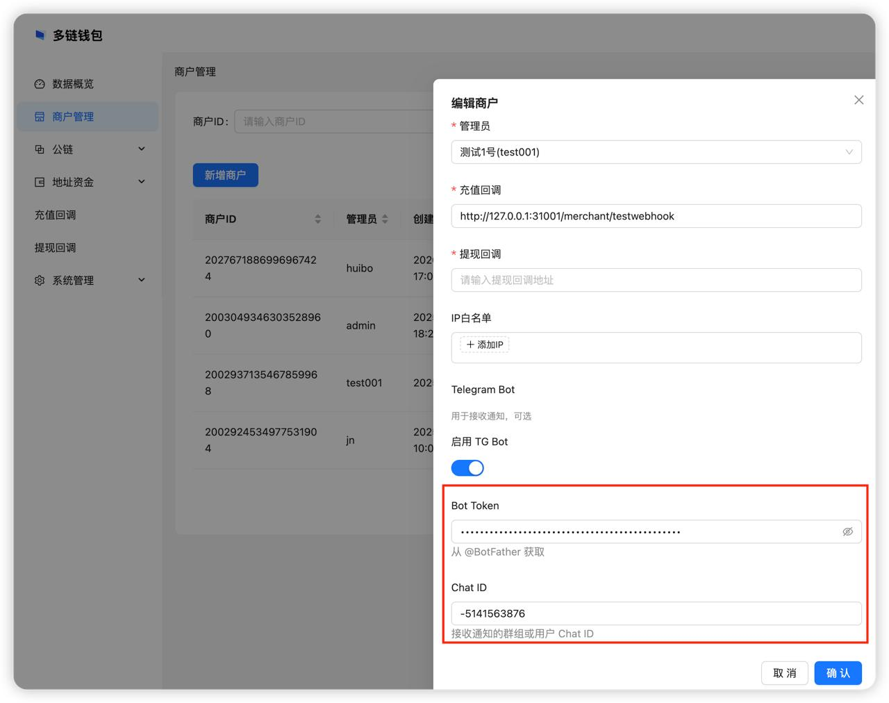

# 数字钱包平台 - 第三方接入文档

本文档面向接入方，描述如何通过 API 与数字钱包平台集成，包括鉴权方式、接口列表、请求与响应格式。

- [数字钱包平台 - 第三方接入文档](#数字钱包平台---第三方接入文档)
  - [接入流程建议](#接入流程建议)
  - [鉴权说明](#鉴权说明)
    - [API Key](#api-key)
    - [通用响应结构](#通用响应结构)
  - [TRON 相关接口](#tron-相关接口)
    - [地址管理](#地址管理)
      - [生成地址](#生成地址)
      - [地址列表（分页）](#地址列表分页)
      - [按索引查询地址](#按索引查询地址)
    - [提现](#提现)
      - [申请提现](#申请提现)
      - [链上取消提现](#链上取消提现)
      - [提现记录列表（分页）](#提现记录列表分页)
  - [ETH 相关接口](#eth-相关接口)
    - [地址管理](#地址管理-1)
      - [生成地址](#生成地址-1)
      - [地址列表（分页）](#地址列表分页-1)
      - [按索引查询地址](#按索引查询地址-1)
    - [提现](#提现-1)
      - [申请提现](#申请提现-1)
      - [链上取消提现（按 ID）](#链上取消提现按-id)
      - [按 memo 取消提现（ETH）](#按-memo-取消提现eth)
      - [提现记录列表（分页）（ETH）](#提现记录列表分页eth)
  - [回调历史查询](#回调历史查询)
    - [充值回调历史](#充值回调历史)
    - [提现回调历史](#提现回调历史)
  - [平台主动回调（Webhook）](#平台主动回调webhook)
    - [回调签名与认证](#回调签名与认证)
    - [验证收到的签名](#验证收到的签名)
  - [Telegram 通知接入](#telegram-通知接入)
    - [获取 Bot Token](#获取-bot-token)
    - [获取通知群的 Chat ID](#获取通知群的-chat-id)
  - [错误码说明](#错误码说明)
    - [成功与通用错误](#成功与通用错误)
    - [商户 API（v1 接口）](#商户-apiv1-接口)
    - [密钥 / 钱包服务](#密钥--钱包服务)
    - [提现相关](#提现相关)

---

## 接入流程建议

* 平台会给后台用户，[点我登录测试后台](http://154.82.113.141:12583/login)，登录后台创建商户（可能平台给账户前已经创建了），配置充值/提现回调 URL，添加后会生成 **API Key** 和 **Signature Key**。

* 拿到 **API Key** 后，就可以调用api接口了。下面开始对接充值和提现流程
* 充值流程
   * 为用户生成充值地址。 以TRX为例，调用[生成地址接口](#生成地址)可生成。
   * 用户拿到地址后，可以往地址中充值。
   * 钱包系统监测到充值时，会调用在平台中配置的充值回调
* 提现流程
   * 调用提现接口
   * 链上确认后，钱包会调用在平台配置的提现回调
* 注
  * 平台很多通知(如提现资金不足、回调接口异常等）)是通过telegram通知的，建议[配置telegram机器人](#telegram-通知接入)。
  * 平台目前仅支持地eth和tron公链的usdt充值，可以通过如下方式获取测试代币。
    *  波长测试网的usdt是TXYZopYRdj2D9XRtbG411XZZ3kM5VkAeBf。可在https://nileex.io/join/getJoinPage领取测试。
    *  eth的测试的usdt是0xb65F0057AEE4e3D511607a050379B7558a15c67D。这个平台发的测试币，需要找平台要。

---

## 鉴权说明

### API Key

所有接口均需在请求头中携带商户 API Key：

| Header 名称 | 说明 |
|------------|------|
| `apikey`   | 在后台「商户管理」中获取，用于标识商户身份 |

示例：

```
apikey: your_merchant_api_key_here
```

### 通用响应结构

接口统一返回 JSON，所有响应均包含 `code` 与 `msg` 字段；成功时另有 `data` 字段承载业务数据。

**成功时：**

```json
{
  "code": 0,
  "msg": "success",
  "data": { ... }
}
```

**失败时：**

```json
{
  "code": 10001,
  "msg": "错误描述信息"
}
```

- `code`：状态码，**0 表示成功**，非 0 表示失败（具体含义见 [错误码说明](#错误码说明)）
- `msg`：说明信息，成功时为 `"success"`，失败时为具体错误描述
- `data`：业务数据，成功时按接口约定返回；失败时通常无此字段或为空

---

## TRON 相关接口

基础路径：`/v1/tron`

### 地址管理

#### 生成地址

**POST** `/v1/tron/address/gen`

生成一个归属于当前商户的 TRON 充值地址。

**请求体（JSON）：**

| 参数         | 类型 | 必填 | 说明 |
|--------------|------|------|------|
| addressIdx   | int64 | 否  | 自定义地址索引；不传或为 0 时由系统生成 |

**响应 data：**

| 字段       | 类型  | 说明 |
|------------|-------|------|
| addr       | string | 生成的 TRON 地址 |
| addressIdx | int64  | 地址索引（请求传入或系统生成） |

**说明：** 传入已存在的 `addressIdx`，会返回该索引已绑定的地址（幂等）。建议传入用户id。

---

#### 地址列表（分页）

**GET** `/v1/tron/address/list`

分页查询本商户的 TRON 地址列表。

**Query 参数：**

| 参数     | 类型 | 必填 | 说明 |
|----------|------|------|------|
| page     | int  | 是   | 页码，从 1 开始 |
| pageSize | int  | 是   | 每页条数，范围 1～100 |
| addr     | string | 否 | 按地址模糊筛选 |

**响应 data：**

| 字段  | 类型   | 说明 |
|-------|--------|------|
| total | int64  | 总条数 |
| items | array  | 当前页地址列表 |

**items 元素：**

| 字段      | 类型   | 说明 |
|-----------|--------|------|
| addr      | string | 地址 |
| accountID | int64  | 地址索引 |
| createdAt | string | 创建时间（ISO 格式） |

---

#### 按索引查询地址

**GET** `/v1/tron/address/get`

根据地址索引查询本商户下的 TRON 地址。

**Query 参数：**

| 参数      | 类型 | 必填 | 说明     |
|-----------|------|------|----------|
| accountID | int64 | 是  | 地址索引 |

**响应 data：**

| 字段 | 类型   | 说明 |
|------|--------|------|
| addr | string | 对应的 TRON 地址 |

---

### 提现

#### 申请提现

**POST** `/v1/tron/withdraw/apply`

提交一笔 TRX 或 TRC20 提现申请，平台将异步处理并回调结果。

**请求体（JSON）：**

| 参数          | 类型   | 必填 | 说明 |
|---------------|--------|------|------|
| toAddr        | string | 是   | 收款方 TRON 地址 |
| amount        | string | 是   | 提现数量（支持小数，如 "100.5"） |
| contractAddr  | string | 是   | 代币合约地址：提 TRX 时传 `T000000000000000000000000000000000`；提 TRC20 时传对应合约地址 |
| memo          | string | 否   | 备注，会随提现回调带给接入方 |

**响应 data：**

| 字段 | 类型   | 说明 |
|------|--------|------|
| id   | string | 提现记录 ID，用于 [链上取消提现](#链上取消提现) |

成功仅表示已入库，实际到账以回调为准。

**说明：**

- 提现前需在后台为该商户、该合约配置提现参数（最小/最大金额、确认数等），否则会报「withdraw config not found」或「withdraw config disabled」。
- `amount` 需大于 0，且不超过后台配置的 `maxWithdrawAmount`（若已配置）。

---

#### 链上取消提现

**POST** `/v1/tron/withdraw/cancel`

取消一笔尚未广播到链上的提现申请。仅当提现状态为「已入库等待广播」时可取消；一旦已广播则不可取消。

**请求体（JSON）：**

| 参数 | 类型   | 必填 | 说明 |
|------|--------|------|------|
| id   | string | 是   | 提现记录 ID（[申请提现](#申请提现) 接口返回的 `id`） |

**响应 data：** 空对象 `{}`。成功表示已取消，该笔提现不会上链。

---

#### 提现记录列表（分页）

**GET** `/v1/tron/withdraw/list`

分页查询本商户的 TRON/TRC20 提现记录。

**Query 参数：**

| 参数     | 类型   | 必填 | 说明 |
|----------|--------|------|------|
| page     | int    | 是   | 页码，从 1 开始 |
| pageSize | int    | 是   | 每页条数，范围 1～100 |
| addr     | string | 否   | 按地址筛选（from/to） |

**响应 data：**

| 字段  | 类型   | 说明 |
|-------|--------|------|
| total | int64  | 总条数 |
| items | array  | 提现记录列表 |

**items 元素（提现记录）：**

| 字段                | 类型   | 说明 |
|---------------------|--------|------|
| id                  | string | 记录 ID |
| merchantID          | string | 商户 ID |
| from                | string | 转出地址 |
| to                  | string | 收款地址 |
| txid                | string | 交易哈希（已广播后有值） |
| tokenAddress        | string | 代币合约地址（TRX 时为固定常量） |
| tokenSymbol         | string | 代币符号，如 TRX、USDT |
| amount              | string | 提现数量 |
| memo                | string | 备注 |
| status              | int    | 状态：1=已入库等待广播，2=已广播等待确认，3=已完成，4=链上失败，5=已取消，6=未知 |
| confirmNum          | int64  | 所需确认数 |
| currentConfirmNum   | int64  | 当前确认数 |
| createdAt / updatedAt | string | 创建/更新时间 |

---

## ETH 相关接口

基础路径：`/v1/eth`

### 地址管理

#### 生成地址

**POST** `/v1/eth/address/gen`

生成一个归属于当前商户的 ETH 充值地址。

**请求体（JSON）：**

| 参数       | 类型  | 必填 | 说明 |
|------------|-------|------|------|
| addressIdx | int64 | 否   | 自定义地址索引；不传或为 0 时由系统生成 |

**响应 data：**

| 字段       | 类型   | 说明 |
|------------|--------|------|
| addr       | string | 生成的 ETH 地址 |
| addressIdx | int64  | 地址索引 |

规则与 TRON 类似：存在单商户地址数量上限；重复 `addressIdx` 时返回已绑定地址（幂等）。

---

#### 地址列表（分页）

**GET** `/v1/eth/address/list`

分页查询本商户的 ETH 地址列表。

**Query 参数：**

| 参数     | 类型   | 必填 | 说明 |
|----------|--------|------|------|
| page     | int    | 是   | 页码，从 1 开始 |
| pageSize | int    | 是   | 每页条数，1～100 |
| addr     | string | 否   | 按地址模糊筛选 |

**响应 data：**

| 字段  | 类型   | 说明 |
|-------|--------|------|
| total | int64  | 总条数 |
| items | array  | 当前页地址列表 |

**items 元素：**

| 字段      | 类型   | 说明 |
|-----------|--------|------|
| addr      | string | 地址 |
| accountID | int64  | 地址索引 |
| createdAt | string | 创建时间 |

---

#### 按索引查询地址

**GET** `/v1/eth/address/get`

根据地址索引查询本商户的 ETH 地址。

**Query 参数：**

| 参数      | 类型 | 必填 | 说明     |
|-----------|------|------|----------|
| accountID | int64 | 是  | 地址索引 |

**响应 data：**

| 字段 | 类型   | 说明 |
|------|--------|------|
| addr | string | 对应的 ETH 地址 |

---

### 提现

#### 申请提现

**POST** `/v1/eth/withdraw/apply`

提交一笔 ETH 或 ERC20 提现申请，平台将异步处理并回调结果。

**请求体（JSON）：**

| 参数          | 类型   | 必填 | 说明 |
|---------------|--------|------|------|
| toAddr        | string | 是   | 收款方 ETH 地址（0x 开头） |
| amount        | string | 是   | 提现数量（支持小数，如 "100.5"） |
| contractAddr  | string | 否   | 代币合约地址：提 **ETH** 时传空字符串或 `"eth"`；提 ERC20 时传对应合约地址 |
| memo          | string | 否   | 备注，会随提现回调带给接入方，并可用于 [按 memo 取消提现](#按-memo-取消提现-eth) |

**响应 data：**

| 字段 | 类型   | 说明 |
|------|--------|------|
| id   | string | 提现记录 ID，用于 [链上取消提现（按 ID）](#链上取消提现按-id-eth) 或 [提现记录列表](#提现记录列表分页eth) 查询 |
| memo | string | 与请求一致的备注 |

成功仅表示已入库，实际到账以回调为准。提现前需在后台为该商户、该币种配置提现参数；`amount` 需大于 0 且不超过后台配置的 `maxWithdrawAmount`。

---

#### 链上取消提现（按 ID）

**POST** `/v1/eth/withdraw/cancel`

按提现记录 ID 取消一笔尚未广播到链上的提现。仅当状态为「已入库等待广播」时可取消。

**请求体（JSON）：**

| 参数 | 类型   | 必填 | 说明 |
|------|--------|------|------|
| id   | string | 是   | 提现记录 ID（[申请提现](#申请提现-1) 返回的 `id`） |

**响应 data：** 空对象 `{}`。

---

#### 按 memo 取消提现（ETH）

**POST** `/v1/eth/withdraw/cancelbymemo`

按申请时传入的 `memo` 查找本商户下状态为「已入库等待广播」的提现并取消。适用于未保存提现 ID 但已知 memo 的场景。

**请求体（JSON）：**

| 参数 | 类型   | 必填 | 说明 |
|------|--------|------|------|
| memo | string | 是   | 申请提现时传入的备注 |

**响应 data：** 空对象 `{}`。若未找到对应提现则返回错误（如「withdraw not found」）。

---

#### 提现记录列表（分页）（ETH）

**GET** `/v1/eth/withdraw/list`

分页查询本商户的 ETH/ERC20 提现记录。

**Query 参数：**

| 参数     | 类型   | 必填 | 说明 |
|----------|--------|------|------|
| page     | int    | 是   | 页码，从 1 开始 |
| pageSize | int    | 是   | 每页条数，范围 1～100 |
| addr     | string | 否   | 按收款地址筛选 |

**响应 data：** 与 [TRON 提现记录列表](#提现记录列表分页) 结构一致（`total`、`items`）；`items` 中每项含 `id`、`from`、`to`、`txid`、`tokenAddress`、`tokenSymbol`、`amount`、`memo`、`status`、`confirmNum`、`currentConfirmNum`、`createdAt`、`updatedAt` 等。`status` 含义同 TRON：1=已入库等待广播，2=已广播等待确认，3=已完成，4=链上失败，5=已取消，6=未知。

---

## 回调历史查询

### 充值回调历史

**GET** `/v1/list`

分页查询本商户的**充值** Webhook 回调历史（即平台向接入方推送充值通知的记录）。

**Query 参数：**

| 参数     | 类型   | 必填 | 说明 |
|----------|--------|------|------|
| page     | int    | 是   | 页码，从 1 开始 |
| pageSize | int    | 是   | 每页条数，1～100 |
| address  | string | 否   | 按充值地址筛选 |
| txid     | string | 否   | 按交易哈希筛选 |

**响应 data：**

| 字段  | 类型   | 说明 |
|-------|--------|------|
| total | int64  | 总条数 |
| items | array  | 回调历史记录 |

**items 元素：**

| 字段             | 类型   | 说明 |
|------------------|--------|------|
| id               | string | 记录 ID |
| merchantID       | string | 商户 ID |
| address          | string | 充值到的地址 |
| txid             | string | 交易哈希 |
| chain            | string | 链标识，如 tron |
| tokenAddress     | string | 代币合约地址 |
| tokenSymbol      | string | 代币符号 |
| tokenValue       | string | 充值数量 |
| url              | string | 回调 URL |
| httpStatusCode   | int    | 接入方返回的 HTTP 状态码 |
| callbackSuccess  | int    | 回调状态：1=成功，2=重试中，3=重试后失败，4=已手动处理 |
| tryTimes         | int    | 已重试次数 |
| createdAt        | string | 创建时间 |

---

### 提现回调历史

**GET** `/v1/withdraw/list`

分页查询本商户的**提现** Webhook 回调历史（即平台向接入方推送提现结果的通知记录）。

**Query 参数：**

| 参数     | 类型   | 必填 | 说明 |
|----------|--------|------|------|
| page     | int    | 是   | 页码，从 1 开始 |
| pageSize | int    | 是   | 每页条数，1～100 |
| address  | string | 否   | 按地址筛选 |
| txid     | string | 否   | 按交易哈希筛选 |

**响应 data：**

| 字段  | 类型   | 说明 |
|-------|--------|------|
| total | int64  | 总条数 |
| items | array  | 提现回调历史记录 |

**items 元素：** 与充值回调类似，并包含 `memo`、`from`、`withdrawInfo` 等提现相关字段，以及 `isFinalConfirm`（是否已达最终确认数）等。

---

## 平台主动回调（Webhook）

平台会向商户在后台配置的 URL 主动推送**充值**与**提现**结果，接入方需实现可公网访问的 HTTP 接口并验证签名。

### 回调签名与认证

为确保 Webhook 安全，请使用您在「数字钱包」后台配置的**签名密钥（signing key）**生成的 HMAC SHA-256 哈希来验证请求是否来自本平台。

**如何获取 signing key**

- 登录后台（链接由运营提供）
- 进入 **商户管理**，在对应商户下查看并配置 **签名密钥**，**充值回调地址**、**提现回调地址**也在此处设置



**充值回调数据格式**

当商户下的地址发生充值并达到确认数后，平台会将以下 JSON 以 **POST** 方式发送到您配置的**充值 Webhook URL**：

```json
{
    "address": "THotYegdHdngfJBRMpzTiT8J8yV4XhBBfo",
    "txid": "336fc08775278c406ccd1506865d4ac4f1b20c44d7c0a349c4bced36a519ecd9",
    "time": 1735888620,
    "confirmations": 1,
    "chain": "tron",
    "height": 53310985,
    "tokenAddress": "TXYZopYRdj2D9XRtbG411XZZ3kM5VkAeBf",
    "tokenSymbol": "USDT",
    "tokenDecimal": 6,
    "tokenValue": 123.23
}
```

| 字段 | 说明 |
|------|------|
| address | 发生充值的收款地址 |
| txid | 交易哈希 |
| time | 交易时间戳 |
| confirmations | 当前确认数 |
| chain | 链标识，如 tron |
| height | 区块高度 |
| tokenAddress | 代币合约地址 |
| tokenSymbol | 代币符号 |
| tokenDecimal | 代币精度 |
| tokenValue | 充值数量 |

**提现回调数据格式**

提现链上达到约定确认数后，平台会 POST 到您配置的**提现 Webhook URL**，数据格式与充值回调一致，并**多出 `memo` 字段**（即您调用提现申请时传入的备注）：

```json
{
    "address": "...",
    "txid": "...",
    "time": 1735888620,
    "confirmations": 1,
    "chain": "tron",
    "height": 53310985,
    "tokenAddress": "...",
    "tokenSymbol": "USDT",
    "tokenDecimal": 6,
    "tokenValue": 100.5,
    "memo": "123"
}
```

**响应要求**

- 您的服务器收到通知后，**HTTP 状态码必须为 200**，且**响应 body 必须返回字符串 `ok`**。
- 若未按要求响应，平台会自动重试，最多重试 3 次。

### 验证收到的签名

每个出站请求的 Header 中都会携带身份验证签名 **X-Signature**。签名的计算方式为：使用您的**签名密钥**与**请求 body 原文**作为输入，通过 **HMAC SHA256** 算法生成哈希值（十六进制字符串）。

**请求头示例**

```
Content-Type: application/json;charset=UTF-8
X-Signature: your-hashed-signature
```

接入方应使用相同方式计算签名，并与收到的 `X-Signature` 比较，一致则说明请求来自本平台。

**签名验证示例（Python）**

```python
import hmac
import hashlib

# data：webhook 请求的 body 原始字符串
data = bytes('abcde', 'utf-8')
# key：商户在后台配置的 signing key
key = bytes('signkey string', 'utf-8')
# digest 即为 X-Signature 的值
digest = hmac.new(key, data, digestmod=hashlib.sha256).hexdigest()
print(digest)
```

---

## Telegram 通知接入

平台支持将商户相关通知（如提现资金不足、回调接口异常等）通过 Telegram 机器人推送到指定群组。接入前需要先创建 Bot、创建或选定通知群，并在后台配置 **Bot Token** 与 **群 Chat ID**。


### 获取 Bot Token

1. 在 Telegram 中搜索 **@BotFather**，打开官方机器人。
2. 发送 `/newbot`，按提示设置机器人名称（如「钱包通知助手」）和用户名（必须以 `bot` 结尾，如 `my_wallet_notify_bot`）。
3. 创建成功后，BotFather 会发来一串形如 `1234567890:ABCdefGHI...` 的 **Bot Token**。请妥善保存，后续在后台「商户管理」或「通知配置」中填入 **Bot Token** 一栏。

**注意：** Bot Token 相当于机器人密钥，不要泄露给他人或提交到公开仓库。

### 获取通知群的 Chat ID

1. 在 Telegram 中创建一个**群组**（或使用已有群组），用作接收通知。
2. 将你在上一步创建的 **Bot** 邀请进该群（群设置 → 添加成员 → 搜索 Bot 用户名并添加）。
3. 邀请 @chatIDrobot 进群。这个机器人会输出群的chat_id。
4. 群的 **Chat ID**（例如 `-1001234567890`）。复制该数值，在后台配置时填入 **Chat ID** 配置项。

---

## 错误码说明

接口失败时，响应中的 `code` 为非 0 整数，`msg` 为具体错误描述。以下为 API 中可能用到的错误码及含义。

### 成功与通用错误

| code | 说明 |
|------|------|
| 0 | 成功 |
| 10000 | 服务器内部错误（未归类的异常） |
| 10001 | 参数错误（如必填项缺失、格式不正确、业务校验不通过等） |
| 10002 | 没有权限 |
| 10003 | 重复的 key（如重复提交、唯一约束冲突） |
| 10004 | 记录不存在 |
| 10005 | 第三方库/服务错误 |

### 商户 API（v1 接口）

| code | 说明 |
|------|------|
| 14001 | API Key 错误（缺失、无效或与商户不匹配） |
| 14002 | IP 不在白名单 |
| 14003 | 商户数量或资源达到上限 |

### 密钥 / 钱包服务

| code | 说明 |
|------|------|
| 15001 | 签名错误 |
| 15002 | 钱包已锁定 |
| 15003 | 钱包未锁定或状态异常 |

### 提现相关

| code | 说明 |
|------|------|
| 20101 | 提现配置错误（如未配置、已禁用、或参数不合法） |
| 20102 | 提现地址 gas 费不足（TRON 为 TRX，ETH 为 ETH） |
| 20103 | 提现地址代币余额不足 |

接入方可根据 `code` 做分支处理；详细文案以 `msg` 为准。

---
